# CS1331 Homework 06 - EXTREME Poker

EXTREME Poker is a Card Game based on Texas Holdem that you will create the UI for.

[Download zip](hw6-poker.zip)

## Table of Contents
* Introduction
* Problem Description
* Background
* Solution Description
* Extra Credit Opportunities
* JavaDocs
* Checkstyle
* Submitting

## Introduction
The creators of Poker are long gone and the game's rules are now a mystery. Passed down through the years by word of mouth; the game has had many different versions pop up. Your mission if you choose to accept it (which you must unless you want a 0) is to create an implementation of Poker to rule them all called **EXTREME Poker**.

## Problem Description
The logic of EXTREME Poker has already been coded and provided for you. **So you don't have to worry about the logic behind the game!!** Although knowing it might help with testing. You only need to write the code that creates the UI.
Note that there are up to **50 possible bonus points** on this assignment.

## Background
The rules for EXTREME Poker are very similar to Texas Holdem and are as follows:
### Game Flow
1. Two Cards are dealt to each player.
2. A betting round ensues.
    * In a betting round each player, in order, is given the option to Raise, Call, or Fold
    * A raise happens when the player adds more chips to the pot than the previous player.
    * A call happens when the player adds the same amount of chips to the pot as the previous player.
    * A fold happens when a player decides they don't want to continue adding chips and so they quit for that round (forfeiting any chips they have already bet).
    * A player may not raise by more chips than any other player has bet.
    * A betting round ends once every player has called or folded except for the last player that raised.
3. After the first betting round three cards are put down on the middle of the table which any player can use to build their poker hand.
4. Then another betting round happens.
5. Next, one more card is added to the middle of the table which any player can use to build their poker hand.
6. Another betting round.
7. The final card is dealt to the middle of the table.
8. The final betting round occurs.
10. All Cards are revealed and the winner receives the pot or the pot is split amongst winners.
11. The cards are cleared from the table and we go back to step 1.

### Determining the winner
The winner(s) is/are the player(s) with the best poker hand.
A poker hand is made by combining 5 cards. These cards can come from the Player's two cards or from the Cards on the board. Not from other Player's cards. If two players have the same poker hand, then they tie.

The types of poker hands are (in order from best to worst):
* ROYAL FLUSH - A straight from a ten to an ace with all five cards of the same suit.
* STRAIGHT FLUSH - Any straight with all five cards of the same suit.
* FOUR OF A KIND - Any four cards of the same rank.
* FULL HOUSE - Any three cards of the same rank together with any two cards of the same rank.
* FLUSH - Any five cards of the same suit (not consecutive).
* STRAIGHT - Any five consecutive cards of different suits. Aces can count as either a high or a low card.
* THREE OF A KIND - Any three cards of the same rank.
* TWO PAIR - Any two cards of the same rank together with another two cards of the same rank.
* PAIR - Any two cards of the same rank.
* HIGH CARD - Any poker hand not in the above-mentioned poker hands.

### MVC design

MVC stands for model, view, and controller (or view controller).

* Model - The data and data related logic of a program.
    * Our poker related logic and data is in the model.
* View - The visual side of the application. Stores UI related elements and handles UI related logic. View can own elements of the model in some cases.
    * Our UI related logic and data is in the view.
* Controller - The mediator between model and view. View sends user input to the model via the controller and model notifies the view that it needs to update via the controller.
    * The classes in viewcontroller link our UI and our poker logic.

This style of programming is very powerful and is used widely. If you want to learn more you can read this [article](https://en.wikipedia.org/wiki/Model%E2%80%93view%E2%80%93controller) or google it.

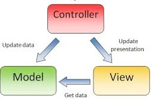

### JavaFx API

JavaFx is a massive Library that contains everything you might need for this assignment. Please look for a solution to any problem using JavaDocs **before** you ask on Piazza.

#### Helpful Classes
If you ever get stuck, try looking at these classes in JavaDocs they are very useful!

* [TextInputDialog](https://docs.oracle.com/javase/8/javafx/api/javafx/scene/control/TextInputDialog.html)
* [Label](https://docs.oracle.com/javase/8/javafx/api/javafx/scene/control/Label.html)
* [TextField](https://docs.oracle.com/javase/8/javafx/api/javafx/scene/control/TextField.html)
* [Button](https://docs.oracle.com/javase/8/javafx/api/javafx/scene/control/Button.html)
* [ImageView](https://docs.oracle.com/javase/8/javafx/api/javafx/scene/image/ImageView.html) and [Image](https://docs.oracle.com/javase/8/javafx/api/javafx/scene/image/Image.html)
* [StackPane](https://docs.oracle.com/javase/8/javafx/api/javafx/scene/layout/StackPane.html)
* [HBox](https://docs.oracle.com/javase/8/javafx/api/javafx/scene/layout/HBox.html)
* [VBox](https://docs.oracle.com/javase/8/javafx/api/javafx/scene/layout/VBox.html)
* [BorderPane](https://docs.oracle.com/javase/8/javafx/api/javafx/scene/layout/BorderPane.html)
* [ScrollPane](https://docs.oracle.com/javase/8/javafx/api/javafx/scene/control/ScrollPane.html)

## Solution Description
**Make sure you read the entire document before starting.**
Feel free to change any provided files even in the model or viewcontroller. Just realize that major changes in provided files will make it harder to give partial credit.

### Viewcontroller:
Everything in the viewcontroller package is provided! But you do need to know about some of the classes.

#### GameState.java

GameState is an enum that represents the different states the game can be in

* `HUMAN_BET` is when the user is betting
* `AI_BET` is when the AI is betting
* `DEALING` is when cards are being dealt
* `DONE` is when a round is done and a new one is ready to be started

#### PokerGameController.java
PokerGameController has a lot of methods but here are the ones you need to know about:

* the constructor takes in a `PokerGame gameView` and a `String name` which is the name of the user.

* `void start()` should be called when the PokerGameController and all Game related UI have been initialized and displayed. This will start the first round of poker. It should only be called once.

* `boolean startNewPokerHand()` should be called every time a new hand is ready to be started. It is also called by start(). It returns true if a new game was successfully started.

* `boolean humanBet(int bet)` is called when the user wants to raise. It takes an int parameter and raises by that much. It returns whether or not the raise was successful.

* `boolean humanCall()` is used when the user wants to call. It returns whether or not the call was successful.

* `boolean humanFold()` is used when the user wants to fold. It returns whether or not the fold was successful.

* `Player getLeftPlayer()` is a getter for the Player object that should be displayed on the left.

* `Player getTopPlayer()` is a getter for the Player object that should be displayed on the top.

* `Player getRightPlayer()` is a getter for the Player object that should be displayed on the right

* `Player getbottomPlayer()` is a getter for the Player object that should be displayed on the bottom.

* `Board getBoard()` is a getter for the Board object.

* `GameState getState()` is a getter for the GameState.

* `setShouldThink(boolean think)` is also useful for testing but not necessary. Only use it for testing though and **DO NOT** leave it in the version you turn in.

### Model:
Everything in the model package is provided! But you do need to know about some of the classes.

#### Suit.java

Suit is an enum that represents the suit of a Card.
The possible Suits are: `HEART`, `DIAMOND`, `CLUB`, `SPADE`

Suit has one important method:

* `String getStr()` which returns the String representation of the Suit.

#### CardValue.java
CardValue is an enum that represents the rank of a Card.
The possible CardValues are: `ACE`, `KING`, `QUEEN`, `JACK`, `TEN`, `NINE`, `EIGHT`, `SEVEN`, `SIX`, `FIVE`, `FOUR`, `THREE`, `TWO`

CardValue has one important method:

* `String getStr()` which returns the String representation of the CardValue.

#### Card.java

Card has the following methods that you need to use:

* `Suit getSuit()` returns the Suit of the Card.

* `CardValue getCardValue()` returns the CardValue of a Card.

#### Player.java

Player has the following methods that you need to use:

* `int getMoney()` which returns how many chips a Player has remaining.

* `Card getCard(int c)` which returns the cth Card that the player has. So `getCard(0)` and `getCard(1)` would return the two cards that a Player can have.

#### Board.java

Board has the following important methods:

* `int getNumCards()` which returns the number of cards on the board at the moment.
* `Card getTableCard(int i)` which returns the ith Card on the board.
* `Card[] getCards()` which returns an array of the cards on the board.
* `int getPot()` which return the amount of chips in the pot.

### View:
This is what you have to write.

#### PokerGame.java

PokerGame is an Application and is the class where your main method will reside.
PokerGame has four methods: main(), start(), startGame(), and updatesMade().

* `void main(String[] args)` is provided and you don't need to edit it.
* `void start(Stage ps)` is called automatically once you launch the JavaFx application. You should display the StartScreen here.
* `void startGame(String name)` is called by StartScreen once StartScreen is finished and should change the Scene to display the GameScreen, ControlPane, and Console. It takes in a String parameter which is the name of the user.
* `void updatesMade()` is called by your PokerGameController whenever updates to the UI need to be made. This should update the GameScreen and ControlPane.
    * HINT: different methods will be called in the GameScreen and ControlPane based on what the GameState is.

#### StartScreen.java

StartScreen is a StackPane that is displayed first when the program is run.

When displayed StartScreen should look similar to this:

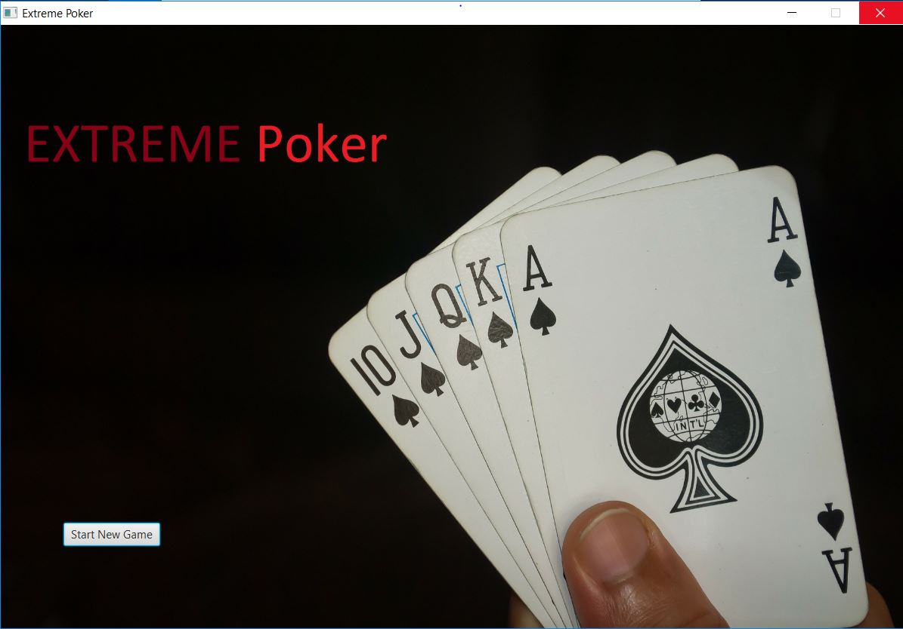{:height="525px" width="750px"}

- StartScreen only needs a constructor where you add the background image and start Button. The constructor also takes a PokerGame object as a parameter.
- When the start Button is pressed, a prompt asking for the user's name should pop up which looks similar to this (don't worry if it is not exactly the same):

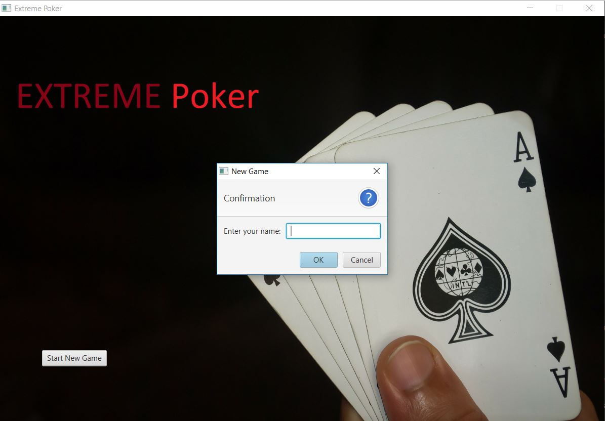{:height="525px" width="750px"}

- Once the name is entered call the startGame() method in PokerGame and pass in the name.

#### GameScreen.java

GameScreen is a BorderPane and contains all of the UI related to playing the Game.

* It will own four PlayerAreas and a BoardArea.

* At the start of each round the GameScreen should look similar to this:

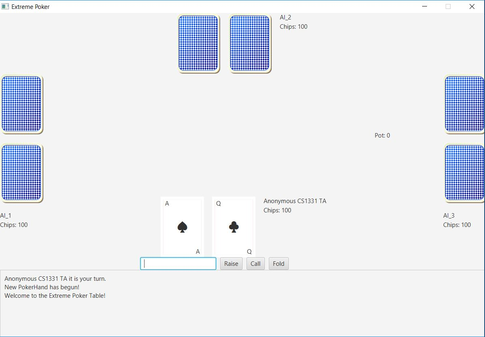{:height="525px" width="750px"}

* After the first three cards are dealt the GameScreen should look similar to this:

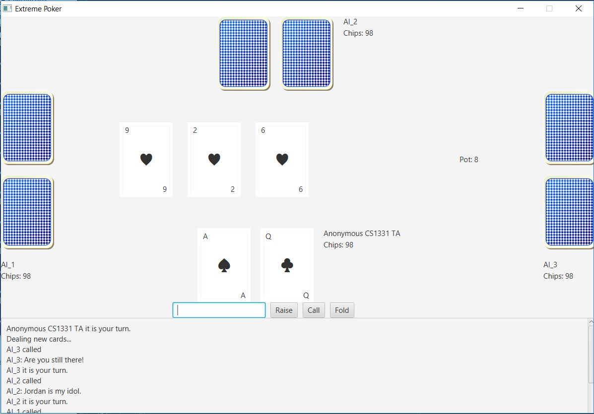{:height="525px" width="750px"}

* After the fourth card is dealt the GameScreen should look similar to this:

{:height="525px" width="750px"}

* After the fifth card is dealt the GameScreen should look similar to this:

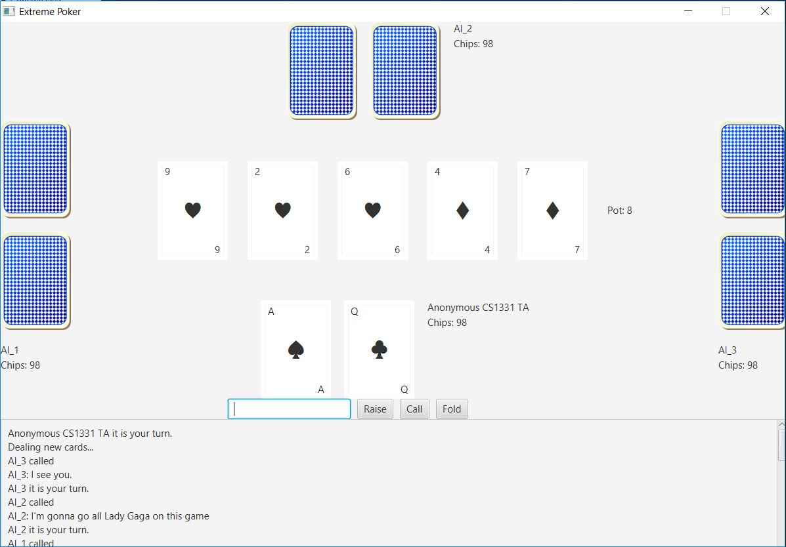{:height="525px" width="750px"}

* After the round is over the GameScreen should look similar to this with all cards revealed:

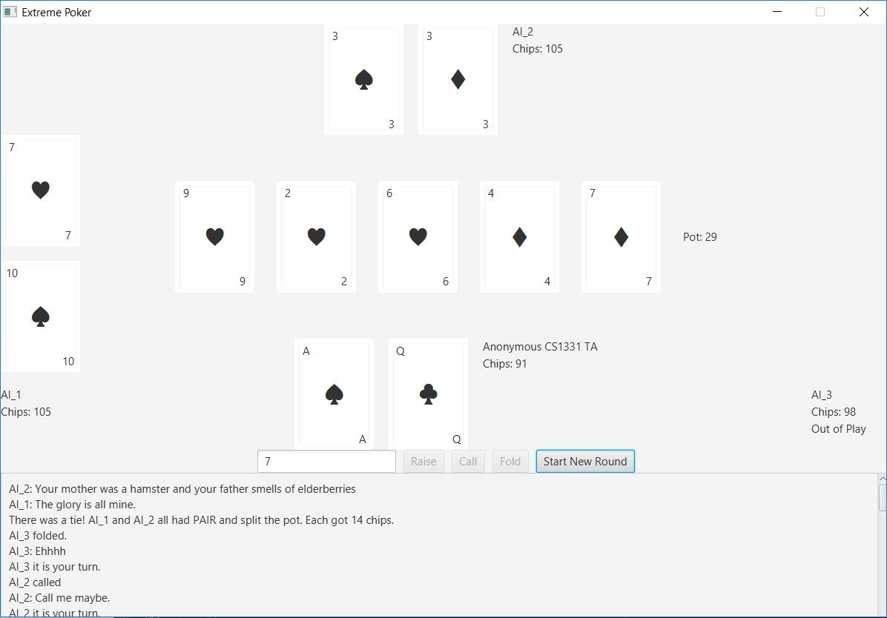{:height="525px" width="750px"}

Note also that AI_3 has folded and is therefore out of play so its cards were hidden.

GameScreen has a constructor and two methods, updatesMade() and endOfRound()

* the constructor takes in a PokerGameController object and should initialize the PlayerAreas and BoardArea.
* `void updatesMade()` is called whenever normal updates to the GameScreen need to be made (e.g. updating the pot or PlayerAreas).
* `void endOfRound()` is called whenever end of round updates need to be made (e.g. showing the front of all of the cards)

#### PlayerArea.java

PlayerArea owns a Pane where all of its contents will be added and contains all of the UI related to any individual Player.

* It will need a way to display the Player's two cards, name, chips, and an out of play indicator

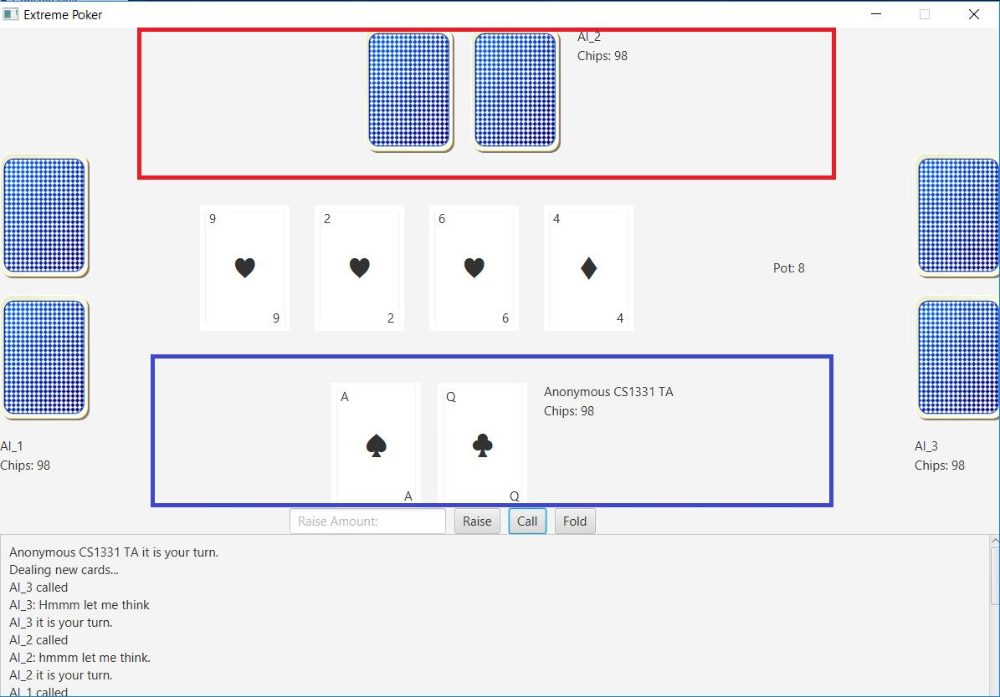{:height="525px" width="750px"}

Above are two highlighted PlayerAreas. The PlayerArea where the user's cards are is in blue. Only the user's cards should be shown until the end of the round when all cards are shown.

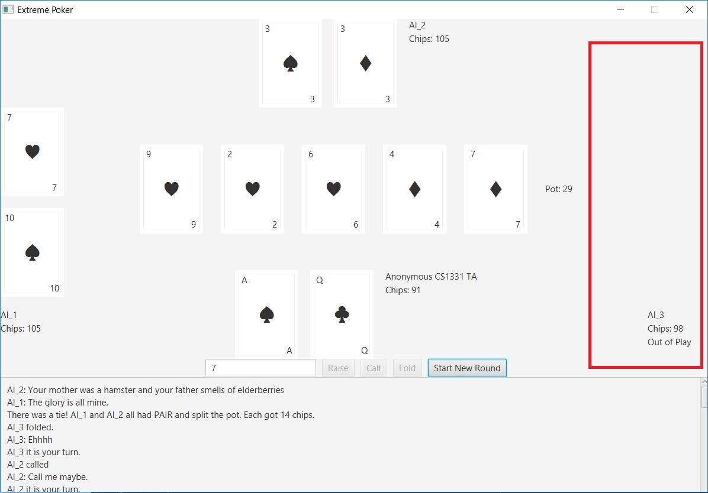{:height="525px" width="750px"}

Above is highlighted a PlayerArea whose Player is out of play. Its cards have been hidden and the out of play indicator has been shown. All the other PlayerAreas' cards have been shown because it is the end of a round.

PlayerArea has a constructor and two methods, playerPane() and update()

* the constructor takes in a Pane and a Player and will be called by HorizontalPlayer or VerticalPlayer. It should initialize all UI elements and add them to the pane.
* `Pane playerPane()` is written for you and doesn't need to be changed. It returns the pane where all UI elements for a PlayerArea are added.
* `void update(boolean showDetails)` takes in a boolean showDetails which is true whenever the details of the front of the cards are supposed to be shown false otherwise. It should update the UI of the PlayerArea.

#### VerticalPlayer.java and HorizontalPlayer.java

These two classes are both PlayerAreas and are both very simple. They have been written for you and don't need to be edited.
They both have constructors that take in the Player to display.

* VerticalPlayer represents a PlayerArea that is Vertically aligned.
* HorizontalPlayer represents a PlayerArea that is Horizontally aligned.

**IMPORTANT**: The PlayerAreas on the left and right of your GameScreen should be instantiated as VerticalPlayers and the PlayerAreas on the top and bottom of your GameScreen should be instantiated as HorizontalPlayers.

#### CardView.java

CardView is mostly written for you. It has a constructor and four methods: setCard(), show(), hide(), and hideDetails().

* The constructor adds all of the UI elements associated with a CardView and is provided.
* `void setCard(Card c)` changes which card is displayed in this CardView and is provided. It takes a Card as an argument.
* `void show()` shows the front of the CardView and its details.
* `void hide()` hides the card totally.
* `void hideDetails()` hides the front of the card and shows the back.

#### BoardArea.java

BoardArea owns an HBox that contains all of the UI elements that have to do with the Board.

* It will need to display the CardViews of the cards on the board and the pot.

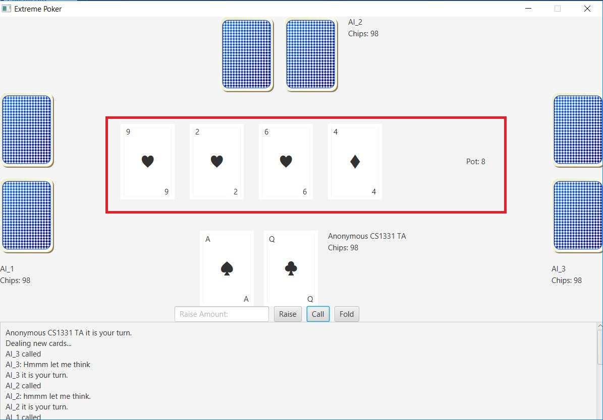{:height="525px" width="750px"}

Above is highlighted the BoardArea. At this point in the game only four cards are shown and the fifth is hidden. Also, the pot is shown with room for the fifth card to be shown.

BoardArea has a constructor and two methods, getPane() and update().

* the constructor takes in a Board object and should initialize all of the UI elements.
* `HBox getPane()` is written for you and doesn't need to be changed. It returns the pane where all UI elements for a BoardArea are added.
* `void update()` should update the UI of the BoardArea.

#### ControlPane.java

ControlPane is an HBox that contains all of the UI for controlling the game.

* It must have an area to input the raise amount and four buttons for raise, call, fold, and starting a new round.
* raise button should raise by the amount inputted, call button should call, fold button should fold, and start new round should start a new poker hand.
* The button for starting a new round should be hidden unless it is the end of a round.
* The buttons for raise, call, and fold should be disabled unless it is the user's turn

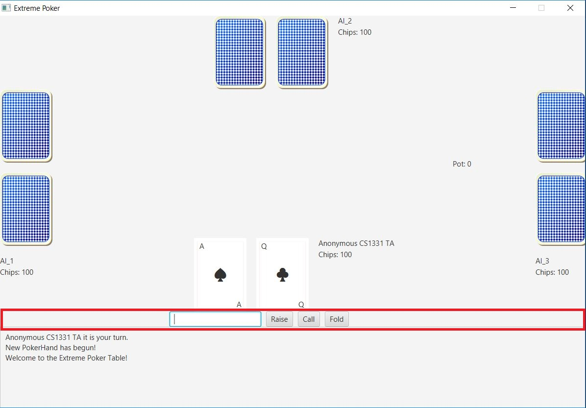{:height="525px" width="750px"}

Above is highlighted the ControlPane. It is not the end of a round so the start new round button is hidden and it is the User's turn so the other buttons are not disabled.

ConrtolPane has a constructor and two methods, playerTurn() and endOfRound().

* the constructor takes in a PokerGameController and adds all of the UI elements.
* `void playerTurn()` is called when it is the user's turn again and the buttons should no longer be disabled.
* `void endOfRound()` is called when it is the end of a round and the start new round button should be shown.

#### Console.java

Console is a ScrollPane and contains all of the UI elements for the Console at the bottom of the Stage.

* Console's content is a Label whose text wraps.
* New messages are added to the top of the Label on a new Line.
* The horizontal scroll bar should be removed from the ScrollPane.
* You can use `setVvalue()` in ScrollPane to automatically scroll to the top

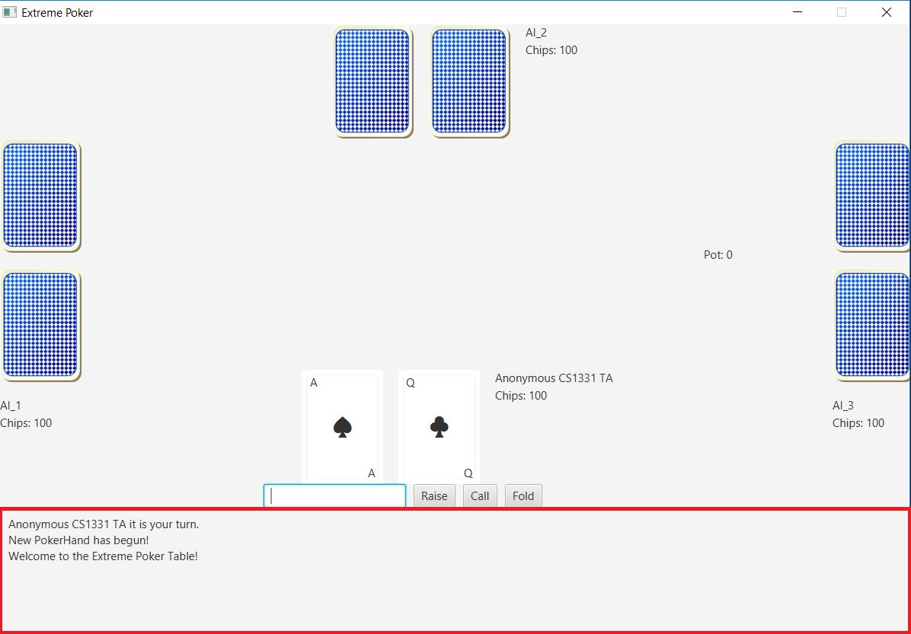{:height="525px" width="750px"}

Above is highlighted the Console.

Console has a constructor and four methods: addText(), clear(), putMessage(), and clearLog().
It also has a static variable of type Console which should be set to the current Console.

* the constructor creates a Label and sets Console's content to be the Label. It also makes the Label's text wrap.
* `void addText(String newText)` takes in a String and adds it to the top of the Console.
* `void clear()` removes all text from the Console.
* `static void putMessage(String message)` and `static void clearLog()` are two static methods and are provided so you don't need to change them.

#### Suggested work flow

1. First create StartScreen.java
2. Use PokerGame.java to display the StartScreen
3. Then do the show() method in CardView.java
    * You'll come back and fill in the rest of the methods later.
4. PlayerArea.java
    * You can create the CardViews in the constructor and also the labels for name, chips, and such.
    * You can omit doing the majority of the update method in PlayerArea **at first**. Just make sure you appropriately use setCard() on the CardViews so you can see them when the PlayerArea is displayed and then **come back later** and do the rest of the update() method.
5. At this point you can create the PlayerAreas in GameScreen.java. Instantiate them inside the constructor and make sure to update them in updatesMade().
    * You can save endOfRound() for later just make sure to come back and do it.
6. Now you can show the GameScreen in PokerGame.java and see all of the work you've just done.
    * You must partially implement updatesMade() in PokerGame.java before the cards will work correctly.
    * Now that you can see what the CardViews and PlayerAreas look like you can go back and fill in the methods you omitted or only partially did.
7. Next up is ControlPane.java. You should initialize all of the UI elements in the constructor.
    * You don't have to do playerTurn() or endOfRound() right away these can be saved for later.
8. Next you should fill in BoardArea.java.
    * Again not every part of the update() method must be working at 100% right away. You can fix things and add things in later.
9. After BoardArea is finished you can finish up the GameScreen.java
    * At this point it might be smart to start going back through and fininshing anything you skipped in any of the classes you've worked on already.
10. Finally, you can implement Console.java and fill anything else in that you didn't do earlier.

## Extra Credit Opportunities
**Cap of 50 points extra credit**

* **5 points** - add in a way to choose the amount of chips Players start with.
* **5 points** - make the Card's suits have color
    * Hearts and Diamonds one color
    * Spades and Clubs another color
* **10 points** - make each of the face cards have a different card background.
    * For example, make the king of hearts look like this:
    
* **10 points** - add in Sound Effects for when cards are dealt and when any button is pressed in ControlPane.
* **20 points** - add in AIs that act differently (e.g. an AI that raises a lot or an AI that is really conservative or an AI that has a chance to bluff)
    * Must add at least two new types of AI (two subclasses of AIPlayer) and have the AI Players be randomly assigned to one of the types.
    * Must document what the new types of AI do in comments and how they do it.
    * The two new types of AI must be intelligent i.e. they don't just bet or fold every time they have some decision making process.
* **40 points** - add the ability to save your game to a file and reload it.
    * Must add some visual way to save and load games.

## Compiling and Testing
To compile the homework you can use:
`javac src/main/java/model/*.java src/main/java/viewcontroller/*.java src/main/java/view/*.java`
And to run the homework you can use:
`java -cp src/main/java view.PokerGame`

Run these commands from outside the src directory.

## JavaDocs
JavaDocs will be the same as last homework. Do not forget them!!

* See the [CS 1331 Style Guide](http://cs1331.gatech.edu/cs1331-style-guide.html) section on Javadoc comments.

## Checkstyle
For *this homework*, the **checkstyle cap is 100**, meaning you can lose up to **100** points on this assignment due to style errors. **Run checkstyle early, and get in the habit of writing style compliant code the first time**. Don't wait until 5 minutes before the deadline to find out that you have 100+ violations. You don't want to get a 0 because you forget to do Checkstyle.

* If you encounter trouble running checkstyle, check Piazza for a solution and/or ask a TA as soon as you can!

* You can run checkstyle on your code by using the jar file found [on the course website](http://cs1331.gatech.edu/cs1331-style-guide.html) like so:
`java -jar checkstyle-6.2.2.jar -a src/main/java/model/*.java src/main/java/view/*.java src/main/java/viewcontroller/*.java`.

* Javadoc errors are the same as checkstyle errors, as in each one is worth a single point and they are counted towards the checkstyle cap.

* **You will be responsible for running checkstyle on *ALL* of your code.**

* You need not worry about style issues in any of the provided files.

* Depending on your editor, you might be able to change some settings to make it easier to write style-compliant code. See [the customization tips page](http://cs1331.gatech.edu/customization-tips.html) (at the bottom) for more information.

## Submitting
You should not import any libraries or packages that trivialize the assignment. Unlike previous homework this **doesn't** include `List`, `Map`, `Set`. If you are unsure of whether something is allowed, ask on Piazza. In general, if something does a large part of the assignment for you, it is probably not allowed.

* The submission tool is included with the HW files. Run it by typing `java -jar hw6-submit.jar`. You can submit as many times as you want so feel free to submit as you make substantial progress on the homework.

* As always, late submissions will not be accepted and non-compiling code will be given a score of 0. For this reason, we recommend submitting early and then confirming that you submitted *ALL* of the necessary files by navigating to the link that the submission tool gives you.